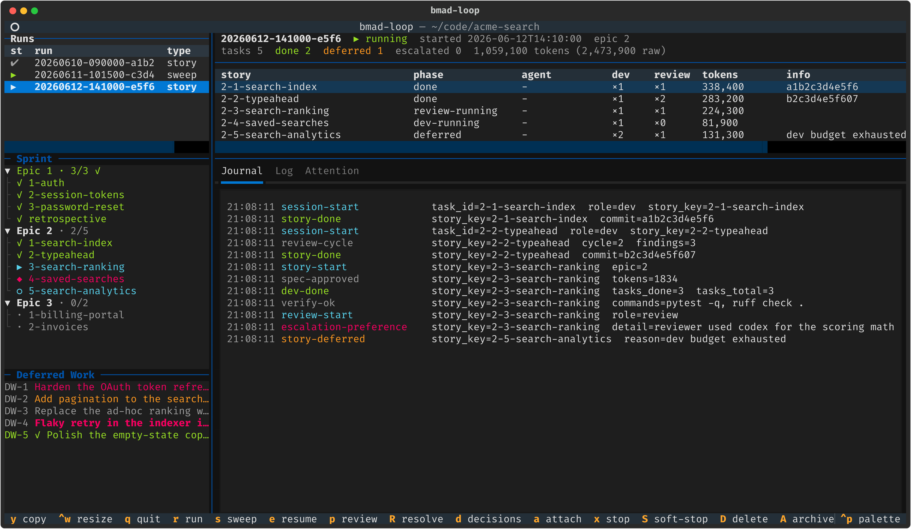
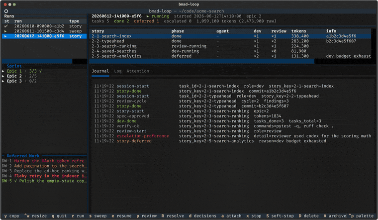
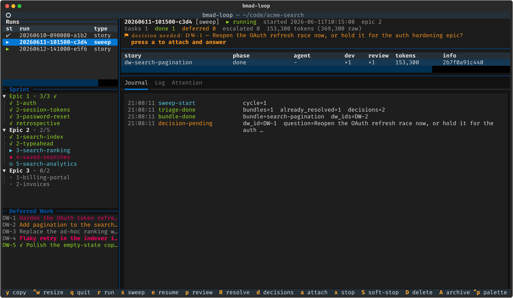
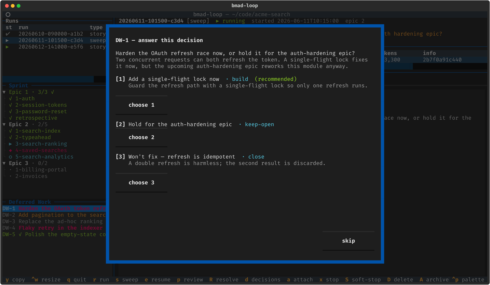
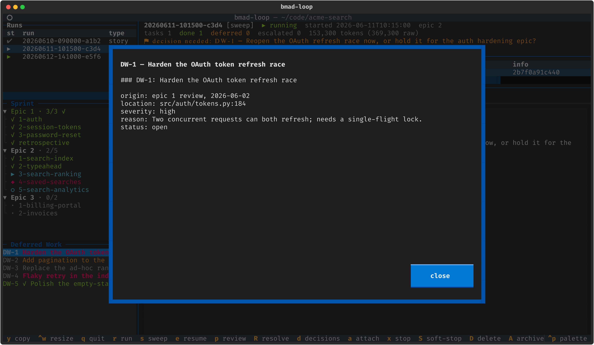
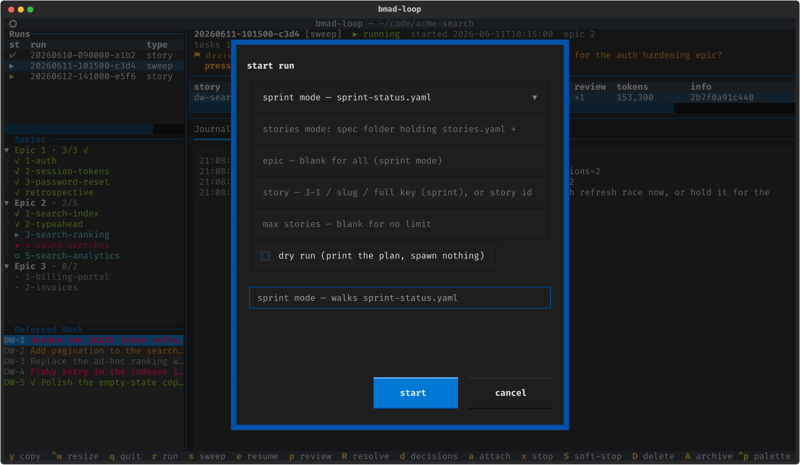
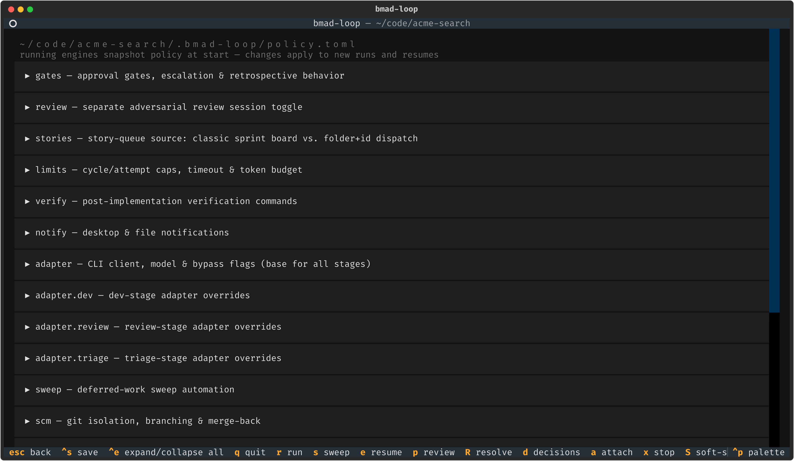
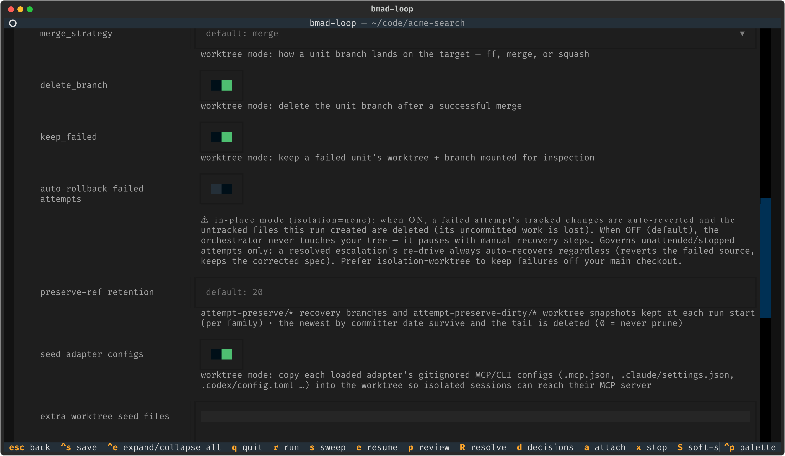

# bmad-loop

<div align="center">

**A deterministic ralph-loop orchestrator for the [BMAD-METHOD](https://github.com/bmad-code-org/BMAD-METHOD) implementation phase**

Plain Python drives the loop — **pick story → implement → adversarially review → verify → commit** — while LLMs do only the creative work, inside disposable, fresh-context coding-agent sessions you can attach to and watch.


[](https://github.com/bmad-code-org/bmad-loop/actions/workflows/ci.yml)




<sub>The live TUI dashboard — run picker, sprint tree, deferred-work ledger, per-story task table, and a tailing journal. <a href="#the-tui">Jump to the TUI tour ↓</a></sub>



<sub>A tour of the dashboard — walking the runs table, unfolding the sprint tree, opening a deferred-work entry, answering a decision a past sweep left unanswered, typing a story into the start-run modal, a sweep blocked on a decision, and scrolling the policy editor out to its worktree-isolation + config-seeding knobs. <a href="#the-tui">More on the TUI ↓</a></sub>

</div>

---

> ⚠️ **Early open beta — experimental, and moving fast.** bmad-loop is a young project that
> only just started shipping publicly. Expect rough edges, docs that lag the code, and
> **breaking changes in any release while it is pre-1.0** — CLI flags, policy keys, on-disk
> run state, and skill contracts can all shift between versions. It also drives real coding
> agents that write and commit in your repository, so point it at work you can review and
> roll back (`[scm] isolation = "worktree"` keeps a failed attempt off your main checkout),
> pin a release tag if you want a stable base, and read the [CHANGELOG](CHANGELOG.md) before
> upgrading. Bug reports and feedback are what the beta is for — open an
> [issue](https://github.com/bmad-code-org/bmad-loop/issues) with `bmad-loop diagnose` output
> attached, or come talk to us on [Discord](https://discord.gg/gk8jAdXWmj).

## Why bmad-loop

Inspired by the original [bmad-automator](https://github.com/bmad-code-org/bmad-automator) (a separate, legacy project), it takes a token-optimized approach in which the orchestrator is ordinary code rather than an LLM session in the control loop:

- 🧠 **No LLM in the control loop.** Story selection, retry budgets, gates, and completion checks are code, not prompts — so they're deterministic, debuggable, and free.
- 📡 **No pane-scraping.** Coding-agent hooks (`Stop` / `SessionStart` / `SessionEnd` / `PreCompact`) write structured event files the orchestrator watches; skills in automation mode write a machine-readable `result.json` at the end of each workflow.
- 🔍 **Trust nothing, verify everything.** After each session the orchestrator checks artifacts on disk: spec frontmatter status, baseline-commit validity, non-empty diff, sprint-status sync, and _your_ test/lint commands before any commit. An exact recorded baseline passes; so does a uniquely resolved immutable descendant that is reachable from `HEAD`, but its proof is measured after that commit and must be tracked, staged, or committed — untracked-only residue does not count. Deferred-work bundles retain their older-ancestor exception. In the default shared checkout, later tracked changes prove work exists but cannot identify which session made it; `[scm] isolation = "worktree"` preserves that provenance.
- 📒 **One source of truth.** `sprint-status.yaml` is the workflow ledger: the loop's dev skill flips only its story spec's status, the orchestrator mirrors that onto the board through a single idempotent, never-regress writer, and verification re-checks the stage after every session.
- 🪟 **Fresh context per step.** Dev and review are separate sessions — review never inherits the implementer's context, so there's no anchoring bias.
- ♻️ **Resumable & multi-agent.** Every run is a resumable state machine on disk, and a generic tmux adapter drives `claude`, `codex`, `gemini`, `copilot`, or `antigravity` (mix per stage).
- 🌿 **Optional worktree isolation.** Opt in (`[scm] isolation = "worktree"`) and each story runs in its own git worktree/branch and merges back locally — your main checkout stays free while a run is in flight.

## Requirements

- **Python 3.11+**, a **terminal multiplexer** (tmux is the bundled default; 3.2 is the supported minimum, not enforced at selection), **git 2.34 or newer** (the supported minimum, and this one _is_ enforced — `run`, `sweep` and `resume` refuse to start below it and `validate` reports it as a problem), and a supported coding CLI — `claude` by default; `codex`, `gemini`, `copilot`, and `antigravity` (`agy`) via [profiles](#other-coding-clis).
- **Linux or macOS** (or **Windows via WSL**, which _is_ Linux — it runs as-is). tmux is the bundled terminal-multiplexer backend (externals like the [herdr adapter](https://github.com/pbean/bmad-loop-adapter-herdr) co-install as packages and self-register — see [Terminal multiplexer backends](docs/multiplexer-backends.md)), and all of it sits behind a pluggable **registry** of OS seams (transport, process lifecycle, hook interpreter) with availability-aware selection — env var → persisted `[mux] backend` choice (`bmad-loop mux set <name>`) → platform default (`psmux` on Windows, `tmux` elsewhere) → first available platform match — so a native-Windows backend slots in as new files + a registration line each, with no engine edits — see [Porting bmad-loop to a new OS](docs/porting-to-a-new-os.md). Native Windows is not yet shipped.
- A **BMAD v6 project** (`_bmad/bmm/config.yaml`, a `sprint-status.yaml` from `bmad-sprint-planning`) on **BMAD-METHOD ≥ 6.10.0**, with three skill sets installed (standard BMAD skills stay untouched):
  - the upstream dev primitive — `bmad-build-auto`, or a complete `bmad-dev-auto` on pre-rename releases. bmad-loop drives whichever is on disk under that name, so either era works with no config edit; the bare forwarding shim the rename leaves behind is refused as incomplete — it has neither `step-04-review.md` nor `customize.toml` — because a session dispatched into it stalls on an interactive migration gate.
  - the review-layer skills its step-04 invokes inline — `bmad-review-adversarial-general` + `bmad-review-edge-case-hunter`, or the merged `bmad-review` skill that supersedes them in newer releases.
  - the bmad-loop skill module from this repo (`bmad-loop-resolve`, `bmad-loop-sweep`) — see [Installing the skill module](#installing-the-skill-module).

## Quick start

```bash
uv sync --extra tui              # core is pyyaml-only; [tui] adds the dashboard

cd /path/to/your/bmad/project
bmad-loop init                   # installs bmad-loop-* skills + hooks + .bmad-loop/policy.toml + gitignore
bmad-loop validate               # preflight: config, sprint-status, git, tmux, CLI, hooks
bmad-loop run --dry-run          # print the plan without spawning anything
bmad-loop run                    # go
bmad-loop tui                    # …or drive everything from the dashboard
```

> **One-time setup:** if the coding CLI has never run in the target project, start it once (`claude`) and accept the workspace-trust dialog (and any hooks-approval prompt) before `bmad-loop run`. Spawned sessions can't answer first-run dialogs, and a pending dialog reads as a session timeout to the orchestrator.

## Command reference

| Command                                                  | What it does                                                                                                                                                                                                                                                                                                                                                                                                                                                                                                                                                                                                                                                                                                                                                                                                                                                                                                                                                   |
| -------------------------------------------------------- | -------------------------------------------------------------------------------------------------------------------------------------------------------------------------------------------------------------------------------------------------------------------------------------------------------------------------------------------------------------------------------------------------------------------------------------------------------------------------------------------------------------------------------------------------------------------------------------------------------------------------------------------------------------------------------------------------------------------------------------------------------------------------------------------------------------------------------------------------------------------------------------------------------------------------------------------------------------- |
| `bmad-loop init`                                         | Install the bundled `bmad-loop-*` skills, the hook relay, `.bmad-loop/policy.toml`, and a gitignore for the runs dir, plugin caches, and policy.toml itself (policy is per-machine — see the CHANGELOG migration note for repos initialized before this). `--cli <profile>` (repeatable) targets specific agents; `--no-skills` / `--force-skills` control skill copying.                                                                                                                                                                                                                                                                                                                                                                                                                                                                                                                                                                                      |
| `bmad-loop validate`                                     | Preflight every prerequisite: BMAD config, sprint-status, git, CLI binary, hook registration, and a platform check that reports the selected multiplexer's readiness and process host (listing every registered backend when more than one is detected). `--spec <folder>` validates that folder's `stories.yaml` for a stories-mode run instead of the sprint-status queue. `--json` emits the preflight as a stable machine-readable document (see [Scripting `validate`](#scripting-validate)).                                                                                                                                                                                                                                                                                                                                                                                                                                                             |
| `bmad-loop mux`                                          | List registered terminal-multiplexer backends — platform match, availability, version, and which one is selected (and why). `mux set <name>` persists a machine-scoped choice into `.bmad-loop/policy.toml` (`--clear` reverts to auto-select, `--force` allows a name that only registers on the target machine); the `BMAD_LOOP_MUX_BACKEND` env var outranks it.                                                                                                                                                                                                                                                                                                                                                                                                                                                                                                                                                                                            |
| `bmad-loop adapters`                                     | List registered coding-CLI adapter **kinds** — name, builtin/external, whether the family drives a multiplexer, and which profiles select each — the CLI axis's counterpart to `mux`. Unlike `mux` there is no global choice to persist: a kind is selected per profile by its `adapter` field. A profile naming an unregistered kind, and any out-of-tree adapter/profile package that failed to load, get a `warning:` on stderr.                                                                                                                                                                                                                                                                                                                                                                                                                                                                                                                            |
| `bmad-loop run`                                          | Drive the dev → review → verify → commit loop. `--epic N`, `--story KEY`, `--max-stories N`, `--dry-run`. `--spec <folder>` forces **stories mode** (folder+id dispatch off `<folder>/stories.yaml`), overriding `[stories].source`; `--story` then filters by story id.                                                                                                                                                                                                                                                                                                                                                                                                                                                                                                                                                                                                                                                                                       |
| `bmad-loop sweep`                                        | Triage + execute open `deferred-work.md` entries. `--no-prompt`, `--decisions-only`, `--max-bundles N`, `--repeat`, `--max-cycles N`, `--dry-run`. `--archive [--before DATE]` instead moves closed ledger entries to `deferred-work-archive.md`, leaving id-preserving stubs.                                                                                                                                                                                                                                                                                                                                                                                                                                                                                                                                                                                                                                                                                 |
| `bmad-loop resume <run-id>`                              | Continue a run paused at a gate, escalation, or interruption.                                                                                                                                                                                                                                                                                                                                                                                                                                                                                                                                                                                                                                                                                                                                                                                                                                                                                                  |
| `bmad-loop resolve <run-id>`                             | Resolve a CRITICAL escalation: open an interactive resolve agent to fix the frozen spec, then re-arm the story and resume. On an _intent gap_ the re-drive can resume review on the attempted change instead of re-implementing it. `--story KEY`, `--no-interactive`, `--restore-patch <path>` (intent-gap patch-restore), `--resume` / `--no-resume`, `--force` (proceed when engine liveness is unverifiable; a provably-live engine still blocks).                                                                                                                                                                                                                                                                                                                                                                                                                                                                                                         |
| `bmad-loop decisions`                                    | Answer deferred-work decisions earlier sweeps left unanswered (skipped by `--no-prompt`, or an abandoned interactive sweep). Recorded so the next sweep acts on them without re-asking. `--list` shows them without answering; `--json` emits them as a stable machine-readable document — id, question, context, recommendation, and every option's key/label/effect/intent/resolution/bundle-name with a derived `recommended` flag. It implies the listing and never prompts, so a script can select an option by policy instead of scraping the text.                                                                                                                                                                                                                                                                                                                                                                                                      |
| `bmad-loop confirm <story-key>`                          | Complete a story parked at `awaiting-operator` once you have carried out the external actions it owes (buy the domain, publish the DNS record). Acknowledges each action in turn, writes the spec's `## Operator Confirmation` audit section, advances spec and board to `done`, and commits the pair — nothing is re-driven. `--list` shows every parked story and what it owes; `--yes` skips the prompts; `--reverify` re-runs the project's `[verify]` commands first and blocks the confirmation if they fail; `--json` emits the parked set as a stable machine-readable document. Every write is checked and the spec is read back from disk, so a story is never declared done over a write that did not land; a confirmation interrupted before its board write is **finished** by re-running the command, with no second prompt and no second audit section. The index it reads is machine-local, so a park is confirmed on the machine that ran it. |
| `bmad-loop list` (`ls`)                                  | List every run/sweep with its short ref, type, and status — the handle you pass to the commands below. `--json` emits a stable machine-readable document instead — one entry per run, oldest first (short ref, run id, type, started-at, liveness-aware status, paused stage); an empty runs dir yields a valid empty document.                                                                                                                                                                                                                                                                                                                                                                                                                                                                                                                                                                                                                                |
| `bmad-loop status [<run-id>]`                            | Run + sprint summary with per-story token totals — cost-weighted, with the raw count alongside — plus a count of decisions awaiting an answer. A stories-mode run instead prints its stories board — id, live on-disk state, checkpoint markers, title. `--json` replaces all of that with a stable machine-readable document (see [Scripting `status`](#scripting-status)).                                                                                                                                                                                                                                                                                                                                                                                                                                                                                                                                                                                   |
| `bmad-loop diagnose [<run-id>]` (`diag`)                 | Emit a **sanitized** diagnostic dump of a run/sweep to hand maintainers when reporting a bug — phase/token/session histograms, escalation counts, adapter/model, env, and run-dir file sizes, with no code, spec content, prompts, transcripts, paths, or PII. Identifiers are pseudonymized to stable per-dump aliases and the output is re-scanned by a fail-closed leak check before writing; a stray pseudonymized identifier is auto-substituted with its alias (disclosed in the report), while PII/secret hits still refuse to emit. Defaults to the latest run. `--all`, `--out`, `--max-journal-entries N`; `--json` emits the dump as a stable JSON document (one object on stdout, no fences) instead of the markdown report.                                                                                                                                                                                                                       |
| `bmad-loop attach [<run-id>]`                            | tmux-attach to a run's live agent session.                                                                                                                                                                                                                                                                                                                                                                                                                                                                                                                                                                                                                                                                                                                                                                                                                                                                                                                     |
| `bmad-loop stop <run-id>`                                | Stop a live run — the engine and its agent tmux session. `--graceful` instead finishes the in-flight item (a story through commit, a sweep bundle through commit), then stops cleanly and stays resumable, and suppresses pending auto-sweeps; `--cancel-graceful` withdraws a pending request. The hard stop is the default and always wins over a pending graceful one.                                                                                                                                                                                                                                                                                                                                                                                                                                                                                                                                                                                      |
| `bmad-loop delete <run-id>`                              | Delete a run directory. `--force` stops the run first if it is still live.                                                                                                                                                                                                                                                                                                                                                                                                                                                                                                                                                                                                                                                                                                                                                                                                                                                                                     |
| `bmad-loop archive <run-id>`                             | Compress a run into `.bmad-loop/archive` and remove the run dir. `--force` stops the run first if it is still live.                                                                                                                                                                                                                                                                                                                                                                                                                                                                                                                                                                                                                                                                                                                                                                                                                                            |
| `bmad-loop cleanup`                                      | Remove leftover tmux artifacts **for the current project**: kill `bmad-loop-<id>` sessions for finished/stopped/interrupted runs (and orphans whose run dir is gone) and close parked `bmad-loop-ctl` windows. `--dry-run` lists without killing. Live runs — and any session/window belonging to another project — are never touched. `--json` emits a stable machine-readable document instead of the text — the run ids whose sessions were removed, the live ids left alone, the ctl windows closed, and a `dry_run` flag — so a preview and the real run share one schema and can be compared.                                                                                                                                                                                                                                                                                                                                                            |
| `bmad-loop clean`                                        | Reclaim **disk** from concluded runs per `[cleanup]`: tear down git worktrees a mid-flight stop orphaned (freeing their Unity `Library/` + MCP-server builds), trim the heavy `worktrees/` tree from runs kept for history (they stay viewable in the TUI), and archive/delete runs past the retention window. Only finished/stopped runs are touched; `--dry-run` previews, `--keep <run-id>` protects, `--retain N` overrides the window, `--hard` deletes instead of archiving. `--json` emits a stable machine-readable document instead of the text — the effective retention policy, `freed_bytes` as a raw integer, and the worktree paths and run ids reclaimed, trimmed, archived, deleted or protected.                                                                                                                                                                                                                                              |
| `bmad-loop tui`                                          | The interactive dashboard (needs the `[tui]` extra). `--low-frame-rate` caps it to 15fps + disables animations (fixes repaint tearing over slow/SSH links; also `[tui] low_frame_rate`).                                                                                                                                                                                                                                                                                                                                                                                                                                                                                                                                                                                                                                                                                                                                                                       |
| `bmad-loop probe-adapter <cli>` (`collect-adapter-data`) | Collect + sanitize the data needed to finalize a CLI adapter profile (hook payload shape, transcript location/format, token schema). Default is a zero-launch **scan**; `--probe` opts into a live capture (`--model` picks the probe turn's model, `--timeout` bounds it, default 90s). `--transcript`, `--session-dir`, `--binary` (CLIs with no profile yet), `--out`; `--json` emits the finding as a stable JSON document instead of the report. See the [adapter authoring guide](docs/adapter-authoring-guide.md).                                                                                                                                                                                                                                                                                                                                                                                                                                      |

Every command takes `--project <dir>` (default: the current directory). Any `<run-id>` may be a
partial — the tail after the last `-` (e.g. `a1b2`), shortened to any prefix that stays unique;
`bmad-loop list` shows each run's short ref.

> One subcommand is deliberately left out of the table: `bmad-loop relay <Event>` writes a single
> session event file from a coding-CLI hook payload on stdin. Its own help calls it "a hook target
> for machines, not a command to run by hand" — it takes no `--project`, and `bmad-loop init`
> currently registers the copied workspace relay (`.bmad-loop/bmad_loop_hook.py`) instead, so no
> installed hook reaches the console script today. Never invoke it yourself.

## The TUI

```bash
uv sync --extra tui       # textual + tomlkit + pyte + rich
bmad-loop tui
```

A live, read-only dashboard over everything below — and a launcher for new runs. It's the fastest way to understand what the orchestrator is doing.

### Dashboard

<div align="center">

</div>

The left column stacks the **runs table** (newest auto-selected; paused runs carry a kind badge, and the title a global _⚑ N need attention_ count), an expandable **sprint tree** — replaced by a **stories board** in stories mode — and the severity-coloured **deferred-work ledger**. The right column shows the run **header** (status, epic, task counts, weighted token total, and the **active agent** driving the current stage), a **per-story table** (phase · agent · attempts · review cycles · tokens · commit/defer), and tabs tailing the **journal**, the session's **pane log**, and the **ATTENTION** file. Every pane boundary is resizable — drag a divider bar or press **`ctrl+w`** — and sizes persist per-project to `[tui]` in `policy.toml` ([TUI guide](docs/tui-guide.md#resizing-panes)). On a paused run, **`p`** opens the stage-appropriate HITL viewer, calling the exact code paths the CLI uses.

### A sweep blocked on a human decision

<div align="center">

</div>

Sweeps run as their own `[sweep]`-tagged runs. When an attended sweep hits a "needs human decision" item it blocks on its own terminal prompt; the dashboard spots the `decision-pending` journal event and raises a banner + toast — press **`a`** to attach to the sweep's window, answer, and detach.

### Answering decisions a past sweep left unanswered

<div align="center">

</div>

Unattended sweeps (`--no-prompt`) skip decisions, and an attended one can be abandoned mid-way — those answers would otherwise be lost. The Deferred Work pane shows the outstanding count (**`— N to answer (d)`**); press **`d`** (or run `bmad-loop decisions`) to walk each one. A `close` is applied immediately; a `build` / `keep-open` is saved to `.bmad-loop/decisions.json` and consumed by the next sweep with no re-prompt.

### Deferred-work entry & the start-run modal

<div align="center">


</div>

`enter` on any ledger row opens the full entry; `r` / `s` open modals to launch a run or sweep (epic, story, max-stories, dry-run). The start-run modal also carries a **source select** (sprint vs. stories mode, prefilled from `[stories]`) and a spec-folder field with a live schedule preview that validates `stories.yaml` and lists the linear schedule with checkpoint markers.

### The policy editor

<div align="center">

</div>

Press **`g`** to edit `.bmad-loop/policy.toml` in a form grouped by section — comment-preserving (tomlkit), validated with the engine's own parser before saving, with unset keys showing their defaults as placeholders. Every section starts collapsed with a one-line description; **`ctrl+e`** expands/collapses all at once.

### Key bindings

| Key       | Action                                                                                                   |
| --------- | -------------------------------------------------------------------------------------------------------- |
| `r` / `s` | start a run / sweep (modal for epic, story, max-stories, dry-run…)                                       |
| `e`       | resume the selected paused/interrupted run                                                               |
| `p`       | review the selected paused run in the stage-appropriate viewer (plan/story checkpoint, gate, escalation) |
| `R`       | resolve a run paused at an escalation (interactive, then re-arm)                                         |
| `d`       | answer deferred-work decisions past sweeps left unanswered                                               |
| `a`       | attach to the live agent session (or the orchestrator window)                                            |
| `x`       | stop the selected live run immediately (engine + agent session)                                          |
| `S`       | graceful stop: finish the in-flight item (through commit), then stop cleanly — stays resumable           |
| `D` / `A` | delete / archive the selected run (force-stops a live run first)                                         |
| `c`       | clean up tmux sessions/windows for finished & stopped runs                                               |
| `v`       | run `bmad-loop validate`, output in a modal                                                              |
| `g`       | settings editor for `.bmad-loop/policy.toml`                                                             |
| `y`       | copy the active Log/Attention pane to the clipboard                                                      |
| `ctrl+w`  | enter/leave pane resize mode (arrows resize, `Tab` picks the boundary) — or drag any divider bar         |
| `M` / `q` | toggle theme (light/dark mode) / quit                                                                    |

**The TUI is an observer/launcher, never the engine.** Runs started with `r`/`s` are detached `bmad-loop` processes in windows of a dedicated tmux session (`bmad-loop-ctl`; on psmux the name carries a per-project registry suffix), so they survive a TUI exit or crash; the dashboard watches runs purely through the run-dir artifacts the engine writes atomically, so runs started from a plain shell show up identically. Launch and attach need tmux; the dashboard itself does not. Pid-based liveness is local-only — a run whose engine died shows `interrupted` (press `e`); runs on other hosts show `unknown`.

> 📖 See **[docs/tui-guide.md](docs/tui-guide.md)** for the full guide — layout, every key and modal, status glyphs, the settings field reference, and troubleshooting. Vector (SVG) versions of every screenshot live in [`docs/images/`](docs/images).

## Two planning pipelines, one loop

bmad-loop drives the same dev → verify → review → commit loop from **either** of two story sources — chosen per project, or per run:

- **Sprint mode (default).** Stories come from `sprint-status.yaml` (written by `bmad-sprint-planning` from your PRD/epics). The loop walks the board by `ready-for-dev` status, keyed by story ref (`1-2-account-mgmt`). This is what the rest of this README describes.
- **Stories mode (opt-in).** Stories come from a typed `stories.yaml` — the **Story Breakdown** output of `bmad-spec`, a fixed-name sibling of `SPEC.md` in the epic's spec folder. The loop dispatches each entry by **folder + id** (`/bmad-build-auto Spec folder: <folder>. Story id: <id>.`, spelled with whichever primitive name resolves on disk); the dev skill creates-or-resumes the story spec at `<folder>/stories/<id>-<slug>.md`, and the orchestrator reads that id-keyed path back deterministically — no shared board to line-edit, no mtime-scan of result artifacts.

Turn it on per project with `[stories] source = "stories"` + `spec_folder = "<epic folder>"`, or per run with `bmad-loop run --spec <epic folder>` (which overrides the policy). Everything downstream — dev/verify/review/commit, worktree isolation, gates, crash resume, the TUI — is identical; only the story source and the per-story controls below differ.

**Per-story human checkpoints (stories mode).** Each `stories.yaml` entry carries two independent boolean flags:

- **`spec_checkpoint`** — pause _before_ code, to review the plan. The dev session halts right after planning (`Halt after planning.`) with the spec at `ready-for-dev`; the run pauses at a **plan checkpoint**. Approve to resume straight to implementation, or request a replan (resets the spec to `draft` so the next dispatch re-plans).
- **`done_checkpoint`** — pause _after_ the story commits, to review the result before the loop moves on (skipped automatically when it is the last story).

An entry may also carry **`closes_deferred`** — the `DW-<n>` ledger ids that story's work closes (see [Deferred-work sweeps](#deferred-work-sweeps)):

```yaml
- id: '3-2'
  title: Export digests
  description: …
  closes_deferred: [DW-5, DW-6]
```

Declaring it here rather than in the story spec is what lets the annotation happen without touching each generated spec: `bmad-build-auto` generates the spec and knows nothing of the ledger, whereas the breakdown is authored while the ledger is in view. A spec that _does_ carry the field in frontmatter is honored too — the two are unioned.

Like `spec_checkpoint` and `done_checkpoint`, this is a **human-authored, caller-only field**. Breakdown time, with the ledger open, is where it belongs — but it is not a deadline: the declaration is read when the story commits, so adding one to a story spec's frontmatter mid-run is honored, and withdrawing one before the commit means it is not closed. Upstream Story Breakdown does not emit it yet ([BMAD-METHOD#2619](https://github.com/bmad-code-org/BMAD-METHOD/issues/2619)), and re-deriving `stories.yaml` rewrites the file — so record the intent in `.memlog.md` alongside the story, or the declaration is lost on the next re-derive.

A story may set both checkpoints (it pauses twice); `gates.mode` pauses stack on top. A blocked story escalates exactly as in sprint mode — `bmad-loop resolve`, then re-arm + resume — now with the story's title/description and the blocking condition surfaced; a pre-planning-halt **sentinel** spec is auto-deleted (a copy preserved under the run dir) on re-arm for a clean re-dispatch.

`bmad-loop run --dry-run --spec <folder>` prints the linear schedule (list order, checkpoint markers, live on-disk state); `bmad-loop status` shows the same stories board.

> Stories mode requires a dev primitive new enough to support folder+id dispatch; the run preflight (and `bmad-loop validate`) checks for it and tells you to update the BMAD module if it is missing. Sprint mode is unaffected and remains the default indefinitely.

## How a story flows

> This is sprint mode's flow. Stories mode swaps the story source (above) and adds the per-story plan/done checkpoints — the loop below is otherwise identical.

```text
sprint-status.yaml: 1-2-account-mgmt: ready-for-dev
  │
  ├─ DEV     tmux window: claude "/bmad-build-auto 1-2-account-mgmt"
  │          bmad-build-auto: plans a 1.5–4k-token spec, auto-approves it,
  │          implements, self-reviews inline (parallel review layers),
  │          commits, finalizes spec → done … Stop hook signals the orchestrator
  ├─ VERIFY  spec exists · status done · baseline matches · diff non-empty
  │          (except a park, which may legitimately have produced none)
  │          · run [verify].commands in repo_root (pytest, ruff…) — a broken build never
  │          reaches review; a failure spawns a fix session fed the output
  ├─ REVIEW  fresh window: claude "/bmad-build-auto <done spec>" — re-invoking on a
  │  (gated) done spec runs a fresh independent step-04 review pass (parallel review
  │          layers → triage → auto-apply patches → ledger → defer ambiguity →
  │          commit). Gated on the skill's `followup_review_recommended` flag
  │          (review.trigger = "recommended") or every story ("always"); bounded
  │          loop, default 3 cycles
  ├─ VERIFY  spec done · sprint done · run [verify].commands again (repo_root) — a failure
  │          routes a feedback-driven dev fix session, then a fresh review cycle
  └─ COMMIT  orchestrator squashes the iteration's commits into one story commit
             (then, under [scm] isolation = "worktree", merges the unit branch
             back into the target branch locally); epic boundary → gate / retro
```

**Failure handling:** bounded dev retries (verify-command failures keep the tree and feed the failing output to the next session via `--feedback`; other failures roll back to baseline), **plateau-defer** when review won't converge (story skipped, spec stashed into the run dir, `deferred-work.md` additions preserved, run continues), and typed escalations — `CRITICAL` pauses the run and notifies you (desktop + `ATTENTION` file), `PREFERENCE` is journaled and the run continues.

**Resolving a CRITICAL escalation:** the escalated story is parked in a terminal `escalated` phase — `resume` skips it. To un-stick it, run `bmad-loop resolve <run-id>` (or press `R` in the TUI). That opens an interactive **resolve agent** seeded with the escalation and the frozen spec; you converse with it to disambiguate the spec, it records the resolution, and on your confirmation the orchestrator re-arms the story (`escalated → pending`, spec status reset to `ready-for-dev`) and resumes — a clean rebuild against the corrected spec, then on through the rest of the sprint. Already fixed the spec yourself? `bmad-loop resolve <run-id> --no-interactive` skips straight to re-arm + resume.

**Intent-gap patch-restore.** When review halted on an **intent gap** — the implementation was sound but read the spec differently than intended — `bmad-build-auto` saves the attempted change as a patch before reverting ([BMAD-METHOD#2564](https://github.com/bmad-code-org/BMAD-METHOD/issues/2564)). If the attempted reading was in fact correct, `resolve` re-arms the spec to `in-review` and re-applies that patch onto baseline after every reset, so the re-driven session resumes **review** on the restored diff instead of re-implementing from scratch. The interactive agent supplies the patch automatically via `resolution.json`; on the hand-driven path pass `bmad-loop resolve <run-id> --no-interactive --restore-patch <path>`. A patch that fails to apply escalates rather than running on a half-restored tree, and deferred-work `sweep` bundles get the same recovery.

## Deferred-work sweeps

Skills accumulate an append-only ledger (`deferred-work.md`, `DW-<n>` entries) of split-off goals, pre-existing review findings, and items deferred as "needs human decision". `bmad-loop sweep` processes it:

```text
bmad-loop sweep [--no-prompt] [--decisions-only] [--max-bundles N] [--repeat] [--max-cycles N] [--dry-run]
  │
  ├─ TRIAGE   fresh window: claude "/bmad-loop-sweep"
  │           verifies EVERY open entry against the actual code (ledger
  │           statuses are unreliable) and returns a machine-validated
  │           partition: already-resolved (orchestrator closes them, with
  │           evidence) · bundles (cohesive buildable groups) · blocked ·
  │           skip · decisions (frozen-block renegotiations, scope reversals)
  ├─ DECIDE   interactive runs walk you through each decision on the
  │           terminal (build / close / keep-open per option, with a
  │           recommendation); answers land in the ledger as `decision:`
  │           lines. Unattended runs skip this and leave decisions open.
  └─ BUNDLES  each bundle runs the normal pipeline: bmad-build-auto (on the bundle
              spec, then re-invoked on the done spec for review) → verify commands
              → commit. The review gate also checks every bundle entry is
              `status: done` in the ledger.
```

**Closing entries from a story.** Sweeps are not the only way an entry gets closed. A story spec can declare the entries its work closes, in frontmatter:

```yaml
closes_deferred: [DW-5, DW-6] # DW-<n> ids this story closes
```

In stories mode the same declaration can live on the `stories.yaml` entry instead (`closes_deferred: [DW-5, DW-6]`), which is where it belongs for an unattended run — the breakdown is authored while the ledger is in view, whereas the story spec is generated later by a dev skill that knows nothing of the ledger. Both channels are unioned. Either way the field is human-authored — like `spec_checkpoint` / `done_checkpoint`, no upstream skill emits it yet, and re-deriving `stories.yaml` drops it unless the intent is logged in `.memlog.md`.

The orchestrator writes the same annotation a bundle close writes — `status: done <date>` and `resolution: resolved by story <id>` — into each declared entry. Without it the ledger is one-way: entries are filed automatically but only ever marked resolved by hand, so a multi-epic run ends with entries that were satisfied epics ago still reading `open`.

**Closure happens at the commit boundary**, after artifact verification, the verify commands, every checkpoint, the review loop and the pre-commit workflows — and just before the story's commit is squashed, so an in-repo ledger carries the annotation in that same commit. A story that fails, blocks, is rejected by review, or escalates closes nothing, and there is nothing to undo. Closure is declared, never inferred from the diff; a resume re-driving the same close is a no-op; and an id that matches no entry is journaled rather than failing the story. The declaration is re-read at that boundary, so an edit made after the story was implemented is the one that counts.

A declaration in a shape nothing can read — a bare `closes_deferred: DW-5` where a list belongs — depends on which channel it is in. In a **story spec** it is journaled and dropped, like an unknown id: the spec is generated mid-run by a dev skill, and a malformed field there must not be able to fail a story that succeeded. In **`stories.yaml`** it is a schema error, exactly like every other manifest field of the wrong type, and the manifest fails to load — the breakdown is hand-authored before the run, where `bmad-loop validate` reports it up front and a typo is still cheap to fix. `validate` warns about unknown ids in both queue modes and about a malformed spec declaration; a malformed manifest is the manifest's own `queue.stories-manifest` failure.

**Blocking a story from the ledger.** Some entries do not merely defer work, they block it: a leg nobody has wired yet is not a nice-to-have for the first story that consumes it. Entries said so in prose (`HARD GATE: must land before 3-2`) long before anything could act on it, and prose gates nothing — `run` picked the story off the board and drove it anyway, and the gate surfaced afterwards, in a diff built on the missing leg. A `gate:` field line makes the claim enforceable:

```markdown
### DW-1: wire the blob-storage credentials

status: open
gate: 3-2, 3-3
```

Until that entry lands, `bmad-loop validate` **fails** for every actionable story a token matches, and `run` **pauses** rather than dispatch one — the gate is enforced at dispatch as well as at preflight, so it no longer depends on remembering to run `validate` first. A token gates a story key when it is that key, or is its prefix at a key boundary — a `-`, or the split-story suffix (one lowercase letter then `-`). So `3-2` covers the sprint key `3-2-invite-link-student-surface`, the stories-mode id `3-2`, and both halves of a split (`3-2a-…`/`3-2b-…`), but never `3-20-later-story`; the split arm is there because breakdown can split a gated story after the gate was written, and a gate that quietly stops matching is worse than none. Closing the entry clears it, and so does dropping the token. This is the only deferred-work check that is a gate rather than an advisory: the `closes_deferred` checks above describe traceability that may be wrong and must never block a run, while this one describes work that must not start.

Only an explicit `status: done <date>` retires a gate. An entry whose status the format cannot read — `status: opne`, or no `status:` line at all — still gates, because an unreadable status is not evidence the work landed; letting it read as closed would have meant one keystroke silently disabling the refusal.

The dispatch pause (`story-gate`, reviewable in the TUI like any other gate) fires before the story is recorded as touched, so closing the entry — by hand or with `bmad-loop sweep` — and resuming runs it. **Sweeps themselves are never gated**: a sweep is what closes the gating entry, so gating it would deadlock the gate against its own remedy. A story whose session already completed **finishes** when the run resumes — its recorded result replays through to commit rather than stranding half-done work; the gate is about work that must not _start_. A resume that instead **restarts** a story, discarding its worktree or resetting to baseline and re-running from scratch, is a start and is asked again: so a gate landing while a run was down still stops the story that run had picked but never got underway, and stops a re-drive of one whose escalation or wedge you have just resolved.

Four shapes declare a gate nothing can enforce, and each is a warning while the entry is unlanded: a token that cannot name a story key (a space-separated `gate: 3-2 3-3`, which is one bad token rather than two good ones, or an unmatchable `gate: 3.2` — note `.` and `_` are fine inside a sprint slug, so `gate: 3-2-a_b` is a real gate); a `gate:` line with nothing usable after the colon; a `gate:` not written lowercase at the very start of a line (`Gate:`, or indented — surfaced rather than accepted, so a fenced example inside an entry cannot become a refusal); and prose declaring `HARD GATE:` on an entry that carries no `gate:` line. The prose arm matches mid-line, because `reason:` prose is hard-wrapped and that is where a real declaration lands — but not directly after a quote character, so an entry that merely cites the phrase stays silent.

> **Ledger outside the repo.** If `implementation_artifacts` is configured outside the project tree, the ledger is shared between worktrees and cannot be part of any commit. The annotation is written all the same, at the same moment, and the run journals `deferred-close-external-ledger` so its absence from git history is not a surprise. A location that cannot be read or written when the write comes due (a shared mount that has gone away) closes nothing and is journaled — those entries stay `open` for a sweep to re-verify, and an outage is never read as "no such entries".

**Answering missed decisions later.** An unattended sweep (`--no-prompt`) skips decisions, and an interactive one can be abandoned before you answer them all — those answers would otherwise be lost, since triage re-derives the decision set from the ledger every run. `bmad-loop decisions` (or press `d` in the TUI) surfaces every decision past sweeps left unanswered, reconstructed from their triage output, and lets you answer them out of band. A `close` is applied immediately; a `build`/`keep-open` is saved to `.bmad-loop/decisions.json` and consumed by the next sweep (build → bundle, keep-open → recorded) with no re-prompt. `--list` shows them without answering; `bmad-loop status` reports the outstanding count.

Sweeps are their own resumable runs (`bmad-loop resume <id>`). `[sweep] auto` in the policy fires an unattended sweep automatically at epic boundaries or run end; a failed/paused child sweep never interrupts the parent run.

Bundle dev sessions can themselves append new deferred entries (split-off goals, review findings). With `[sweep] repeat` (or `--repeat`) the sweep re-triages after each cycle and keeps going on that newly generated work, stopping when a cycle completes nothing addressable — nothing closed as already-resolved or by decision, no bundle done — or at `max_cycles`. Bundles that failed in an earlier cycle and entries a human chose to keep open are never re-bundled.

## Installing the skill module

The orchestrator drives the upstream dev primitive — `bmad-build-auto`, or `bmad-dev-auto` on pre-rename releases — unmodified, so there is no fork to keep in sync; it both implements and (re-invoked on the done spec) runs the follow-up review — plus its own bundled `bmad-loop-*` skills for escalation, sweep, and setup. Your standard BMAD install is never modified. The three bundled skills ship in the `bmad-loop` wheel (canonical source: `src/bmad_loop/data/skills/`, BMAD module code `bmad-loop`) so `bmad-loop init` lays them down for you; the dev primitive and the review-layer skills its step-04 invokes inline are prerequisites installed by the BMad Method (bmm) module:

| Skill                             | Role                                                                                                                                                           |
| --------------------------------- | -------------------------------------------------------------------------------------------------------------------------------------------------------------- |
| `bmad-build-auto`                 | unattended implementation + follow-up review (**upstream** — bmm prerequisite, not bundled; named `bmad-dev-auto` before the rename, and either era is driven) |
| `bmad-review-adversarial-general` | inline step-04 review layer (**upstream** — bmm prerequisite, not bundled)                                                                                     |
| `bmad-review-edge-case-hunter`    | inline step-04 review layer (**upstream** — bmm prerequisite, not bundled)                                                                                     |
| `bmad-review`                     | merged lens-based reviewer, supersedes the hunters (**upstream** — bmm prereq, not bundled)                                                                    |
| `bmad-loop-resolve`               | interactive CRITICAL-escalation resolution (`/bmad-loop-resolve <story>`)                                                                                      |
| `bmad-loop-sweep`                 | deferred-work ledger triage (automation-only)                                                                                                                  |
| `bmad-loop-setup`                 | installs the orchestrator tool from Git, then runs `bmad-loop init` + `validate`                                                                               |

`bmad-loop validate` preflights the dev primitive (always — reporting which name it resolved) plus the review skills that copy of the skill will actually invoke — read from its `customize.toml` review layers, or from `step-04-review.md` on releases that name their reviewers inline. So a merged-`bmad-review` install needs only `bmad-review`, a v6.10.0 install needs the two hunters it names, and a tree whose configured layers reference a skill it does not have is reported instead of failing on every dev run. Missing skills (or a dev primitive without its `customize.toml`) are reported with bmm-module remediation before any run starts.

**Via uv + `bmad-loop init` (self-sufficient).** Installing the tool and running `init` is all you need — `init` installs the `bmad-loop-*` skills into `.claude/skills/` (claude) and/or `.agents/skills/` (codex/gemini) for the CLIs you select, alongside the hooks and policy:

```bash
# latest from main (tracks HEAD — newest features, less stable):
uv tool install "bmad-loop[tui] @ git+https://github.com/bmad-code-org/bmad-loop.git"

# OR a pinned release tag (reproducible — recommended for day-to-day use):
uv tool install "bmad-loop[tui] @ git+https://github.com/bmad-code-org/bmad-loop.git@v0.9.1"

bmad-loop init --project /path/to/project --cli claude   # add --cli codex/gemini as needed
claude "/bmad-loop-setup accept all defaults"            # installs the tool + wires the project
```

The `[tui]` extra pulls in the dashboard/settings UI (textual); drop it for a headless install. `bmad-loop --version` confirms what you've got. Existing skill dirs are left untouched (`--force-skills` to overwrite a stale copy, `--no-skills` to manage skills yourself).

### Upgrading

**Easiest — let the setup skill do it.** Re-running `/bmad-loop-setup` (or `/bmad-loop-setup upgrade`) on an already-installed project performs the two-step ritual for you: it detects the existing install, upgrades the tool with `--reinstall`, and re-lays the per-project skills with `--force-skills` — then reports the before → after version.

```bash
claude "/bmad-loop-setup upgrade"
```

**Manual — the two steps it runs.** Use these directly for non-Claude CLIs, CI, or scripting. Upgrading is two steps — the tool **and** the per-project skill copies, which `init` froze at install time and a tool upgrade does not touch:

```bash
# 1. upgrade the tool. --reinstall is required for a git source: a plain
#    `uv tool upgrade` reuses the cached commit and won't pull new code.
uv tool upgrade bmad-loop --reinstall                      # follows main or your pinned tag
#    to move to a newer tag, re-run install with the new ref:
#    uv tool install --force "bmad-loop[tui] @ git+https://github.com/bmad-code-org/bmad-loop.git@v0.9.1"

# 2. re-lay the refreshed skills into EACH project that uses bmad-loop:
bmad-loop init --project /path/to/project --force-skills
```

Your `.bmad-loop/policy.toml` is left untouched on upgrade — new keys are optional and fall back to their defaults, so configs survive. `init` now also gitignores policy.toml (it is per-machine: it carries the `[mux] backend` choice); if yours is already committed, run `git rm --cached .bmad-loop/policy.toml` once to stop sharing it (your local copy is kept). Check the [CHANGELOG / releases](https://github.com/bmad-code-org/bmad-loop/releases) for what changed between tags.

To remove bmad-loop from a project, see [Uninstalling](docs/setup-guide.md#uninstalling) — it reverses what `init` laid down (state, skills, hooks, gitignore) and uninstalls the tool.

**Via the BMAD-method installer.** The installer copies the bundled `bmad-loop-*` skills into your project (but not the orchestrator tool), alongside the upstream dev primitive the orchestrator drives. Finish setup with `/bmad-loop-setup`, which installs the tool from Git, asks which coding CLIs to drive, registers their hooks (`init` skips the already-present skills), and runs the preflight:

```bash
claude "/bmad-loop-setup accept all defaults"
```

See **[docs/setup-guide.md](docs/setup-guide.md)** for the full walkthrough — choosing CLIs, installing the tool and TUI together or separately, and initializing codex/gemini.

The bundled skills must be installed together with the upstream dev primitive: `bmad-loop-sweep` owns the canonical `deferred-work-format.md` that the orchestrator normalizes the ledger to, and the primitive appends the flat deferred-work entries it normalizes. The primitive is driven unmodified, so its own `customize.toml` applies as-is; it needs no merge — it is consumed directly from the bmm module. There is no review fork to keep in sync: review is just a re-invocation of the primitive on the done spec.

## Policy (`.bmad-loop/policy.toml`)

`bmad-loop init` writes this template; every engine start — `run`, `sweep` and `resume` — stamps it into the run, so edits apply to new runs and to the next resume of an existing one (edit it live from the TUI with `g`).

```toml
[gates]
mode = "per-epic"          # none | per-epic | per-story-spec-approval
retrospective = "notify"   # never | notify | auto

[stories]                  # which planning pipeline drives the loop (see "Two planning pipelines")
source = "sprint-status"   # sprint-status (default) | stories (typed stories.yaml, folder+id dispatch)
spec_folder = ""           # required when source = "stories": the epic spec folder holding stories.yaml
                           # (per-story spec_checkpoint / done_checkpoint pauses live in stories.yaml, not here)

[limits]
max_review_cycles = 3
max_dev_attempts = 2
max_followup_reviews = 1         # extra review rounds granted when a finalized (done) round still recommends a follow-up; once spent, the round converges + refiles instead of burning a cycle; 0 = never honor one
session_timeout_min = 90
git_timeout_s = 120              # bound on any single git subprocess; exceeding it pauses/degrades, never crashes the run
teardown_grace_s = 20            # verified session teardown: poll a killed session up to this long, then force-kill its pane pids and re-kill; 0 = one best-effort kill
stop_without_result_nudges = 1   # times to re-prompt a session that stopped with no result.json
dev_stall_grace_s = 600          # silence grace armed at dev/review launch; transport activity or fresh Stop/idle evidence re-arms it; 0 = no launch timer, but a result-less turn end still fails fast
dev_stall_nudges = 2             # best-effort wake nudges per silent grace; fresh Stop/idle evidence restores this budget; 0 = stall on grace expiry
dev_stall_nudges_cap = 6         # total never-restored nudge bound per dev/review session; an accepted nudge does not guarantee a wake; 0 = stall on first grace expiry
workflow_stall_nudges_cap = 3    # same monotonic cap for an injected plugin-workflow session that finished but never wrote its completion marker
max_tokens_per_story = 2000000
cache_read_weight = 0.1          # cache reads bill at ~0.1x input everywhere; 1.0 = count raw
session_budget_mode = "warn"     # off | warn | enforce — mid-session per-SESSION guard (sampled ~30s); warn = one ATTENTION; enforce = wrap-up nudge then over_budget termination (retry→defer)
max_tokens_per_session = 4000000 # weighted per-session cap the guard trips on; healthy sessions run ~1–2.5M weighted, so the default trips only true runaways
session_budget_grace_s = 240     # enforce mode: seconds to wrap up after the nudge before over_budget termination; 0 = terminate at trip

[verify]
commands = ["pytest -q", "ruff check ."]

[notify]
desktop = true             # desktop notification on gate pauses / escalations — notify-send (Linux) / osascript (macOS) / PowerShell toast (Windows), best-effort
file = true                # append the same alerts to the run's ATTENTION file

[review]
enabled = true             # false = skip the separate review session; the dev pass
                           # runs bmad-build-auto's own inline review layers and finalizes to done
trigger = "recommended"    # when enabled: "recommended" runs the separate review only when
                           # bmad-build-auto flags followup_review_recommended; "always" = every story
                           # (the loop is bounded by limits.max_review_cycles either way)
on_status_contradiction = "escalate"
                           # a review that writes sprint-status back off "done" (revoking the
                           # sign-off the orchestrator recorded at dev time) pauses the run naming
                           # both sides; "retry" = legacy — burn review cycles, then defer + roll back

[dev]                      # which inner dev skill the orchestrator drives
skill = "bmad-dev-auto"    # the only supported value — the generic upstream dev primitive.
                           # Retained as the seam for a future alternative dev skill, and it is
                           # NOT the name sessions are dispatched with: upstream renamed the
                           # primitive to bmad-build-auto, so the invoked name is resolved from
                           # what is on disk and projects on either era work with this untouched.
                           # No settings-schema entry: edit it here, not in the TUI editor.

[adapter]
name = "claude"            # CLI profile: claude | codex | gemini | copilot | antigravity | opencode-http (alias: opencode) | custom
model = ""                 # empty = CLI default (opencode-http wants "provider/model")
cleanup_session_on_finish = true  # kill the run's tmux session when it finishes (false keeps it for inspection)
# extra_args replaces the profile's default bypass flags when set:
# extra_args = ["--permission-mode", "bypassPermissions"]

# Optional per-stage overrides — run the review pass on a different CLI/model
# than the dev pass. Unset keys inherit from [adapter] when the stage runs the
# same client; switching client falls back to that profile's defaults (model
# and extra_args are client-specific).
# [adapter.dev]
# model = "opus"
# [adapter.review]
# name = "codex"
# model = "gpt-5-codex"
# [adapter.triage]            # sweep triage stage
# model = "opus"

[sweep]
auto = "never"             # never | per-epic | run-end (auto sweeps never prompt)
max_bundles = 5            # bundles executed per sweep; triage excess truncated
max_triage_attempts = 2    # triage validation retries before escalating
max_migration_attempts = 2 # legacy-ledger migration retries before escalating
repeat = false             # re-triage after each cycle, continue on new deferred work
max_cycles = 5             # safety cap on cycles per sweep run when repeat = true

[cleanup]                  # disk reclamation for .bmad-loop/runs (terminal runs only)
run_retention = 10         # newest concluded runs kept whole; older ones trimmed/archived by `clean` (0 = none)
retention_days = 0         # 0 = off; else also keep runs newer than N days regardless of count
trim_artifacts = true      # drop the heavy worktrees/ tree from concluded runs (run stays viewable in the TUI)
archive_old = true         # archive (vs hard-delete) runs past the window
auto_clean_on_finish = true # reconcile worktrees leaked by a mid-flight stop at each run/sweep start
clean_tmp = true           # let engine plugins clean their /tmp scratch on finish (e.g. Unity MCP zips)

[scm]                      # source-control isolation + merge-back; defaults = work in place
isolation = "none"         # none | worktree
branch_per = "story"       # story | run (worktree mode only; "run" forces delete_branch = false)
target_branch = ""         # "" = the branch checked out at run start
merge_strategy = "merge"   # ff | merge | squash (how a unit branch lands on the target)
delete_branch = true       # delete the unit branch after a successful merge
keep_failed = true         # keep a failed unit's worktree + branch mounted for inspection
rollback_on_failure = false    # in-place (isolation="none") recovery after a failed attempt: false = pause with manual steps; true = auto-revert the attempt (WARNING: discards its uncommitted work). A resolved escalation's re-drive always auto-recovers regardless; prefer isolation="worktree" to keep your main checkout untouched
preserve_keep = 20             # attempt-preserve/* refs + dirty snapshots kept per family at run start (newest by committer date); the tail is pruned. 0 = never prune
failed_diff_max_mb = 5     # per-file cap (MB) for untracked files in a kept-failed unit's changes.patch
failed_diff_unlimited = false  # true = no size cap on the failed-unit diff (warns when active)
commit_message_template = ""   # {story_key} / {run_id} / {story_title} substituted; empty = built-in default
max_parallel = 1           # units in flight at once (parallel fan-out unbuilt; values > 1 clamp to 1)
seed_adapter_defaults = true   # copy each loaded adapter's gitignored MCP/CLI configs into the worktree
worktree_seed = []         # extra project-relative gitignored files to seed, on top of adapter defaults

[mux]                      # terminal-multiplexer backend — per-machine (policy.toml is gitignored)
backend = ""               # "" = auto-select; else force a registered backend by name (see `bmad-loop mux`)
                           # env var BMAD_LOOP_MUX_BACKEND outranks this

[tui]
low_frame_rate = false     # true = cap to 15fps + disable animations (= bmad-loop tui --low-frame-rate)
# Persisted dashboard pane sizes (terminal cells). 0 = unset → default proportions;
# the TUI writes these when you resize by mouse-drag or the Ctrl+W resize mode.
# left_width = 0           # sidebar width, columns
# runs_height = 0          # Runs pane height, rows
# deferred_height = 0      # Deferred pane height, rows
# tasks_height = 0         # Tasks table height, rows
```

**Gate modes:** `none` runs everything unattended; `per-epic` (default) pauses at epic boundaries; `per-story-spec-approval` pauses after each spec is written so you approve it before implementation is reviewed.

> In **stories mode** the `stories.yaml` list is flat — there are no epics — so the default `per-epic` gate never fires (nothing to bound). Use the per-story `spec_checkpoint` / `done_checkpoint` flags for HITL there, or `per-story-spec-approval` for a run-global spec gate. `none` and `per-story-spec-approval` behave the same as in sprint mode.

**Review:** `[review].enabled = false` drops the separate fresh-context review session; the dev pass instead runs `bmad-build-auto`'s own internal review layers (Blind Hunter / Edge Case Hunter / Verification Gap / Intent Alignment) and finalizes the story straight to `done` — one session per story instead of two, verify commands still gating the commit. Governs deferred-work sweeps too. When review is enabled, `[review].trigger` decides _when_ that separate pass runs: `recommended` (default) only when the `bmad-build-auto` session flags `followup_review_recommended` — it already reviews inline and computes the flag from a severity-weighted score over the final pass's patched findings (BMAD-METHOD#2580); `always` runs it every story. The follow-up loop is bounded by `limits.max_review_cycles` (default 3), which caps oscillation.

`bmad-loop init` (without `--cli`) registers hooks for every CLI profile the policy references, so a dual-client setup needs no extra flags.

### Worktree isolation

By default work happens **in place** on the checked-out branch (`[scm] isolation = "none"` — byte-for-byte the prior behavior). Set `isolation = "worktree"` and each story (and each sweep bundle) runs in its own `git worktree` on a dedicated `bmad_loop/<run_id>[/<story>]` branch cut from the target branch, then merges back into the target **locally** (`merge_strategy` = `ff` / `merge` / `squash`). The main checkout stays free while a run is in flight, and run state never moves into a worktree — `.bmad-loop/` always lives in the main repo.

- **`branch_per`** — `story` (a branch per story) or `run` (one shared branch across the run; this forces `delete_branch = false` so the shared branch survives between units).
- **`target_branch`** — the branch every unit merges into; empty means the branch checked out at run start. A configured branch is created if missing (a detached HEAD or unborn repo pauses the run rather than merging onto an unreferenced commit).
- **`keep_failed`** (default on) — a deferred/escalated unit's worktree + branch stay mounted for inspection, and its full diff (tracked + untracked) is preserved to `run_dir/failed/<unit>/changes.patch`. `failed_diff_max_mb` caps the per-file size of untracked files in that patch (oversized files skipped with a marker); `failed_diff_unlimited` lifts the cap.
- **`rollback_on_failure`** (default off) — governs in-place recovery when `isolation = "none"`. Off pauses a failed unattended attempt with manual-recovery steps and leaves the tree untouched; on auto-reverts its tracked changes and removes only the untracked files the run created (never a blanket `git clean`). A resolved escalation's re-drive always auto-recovers regardless. Under `isolation = "worktree"` the worktree is disposable, so it auto-reverts either way. Any auto-revert first parks the attempt's commits on `attempt-preserve/*` refs, and pauses rather than reset work it could not park; **`preserve_keep`** (default 20) bounds how many such refs are kept per family, pruned oldest-first at run start (`0` = never prune). A parked ref is named in the story's defer notification — with the `git merge --ff-only` line that recovers it, flagged commits-only when the uncommitted snapshot could not be captured — and as `preserve_ref` in `bmad-loop status`/`--json`, verbatim from run state, so a ref a later run's pruning has since deleted is still shown.
- **`commit_message_template`** — when set, the message used for story/bundle commits (`{story_key}` / `{run_id}` / `{story_title}` substituted; the title comes from the spec's `title:` frontmatter, else a first `#` heading, else the story key).
- **`seed_adapter_defaults`** (default on) / **`worktree_seed`** — a worktree checks out _tracked_ files only, so a project's gitignored MCP/CLI configs (`.mcp.json`, `.claude/settings.json`, `.codex/config.toml`, `.gemini/settings.json`) are absent from a fresh worktree — without them an isolated session can't reach its MCP server and stalls on readiness. With `seed_adapter_defaults` on, each loaded adapter's own configs are copied in from the main repo before the session launches (the defaults live in each CLI profile's `seed_files`); `worktree_seed` adds extra project-relative paths on top. Seeding is copy-when-absent and runs before the signal-hook merge, so a seeded `settings.json` keeps its real content and just gains the Stop hook — unless it won't parse, in which case provisioning refuses and the run pauses with the file untouched, rather than the merge replacing it with a hooks-only config (#592). The seeded paths are shielded from the unit's `git add -A`.

Merge-back is always **serialized** — `max_parallel` is a validated knob clamped to `1` until parallel fan-out lands. PRs aren't created automatically; open them by hand from the unit branches afterward if you want them.

<p align="center">

</p>

For a monorepo or any layout where the git root differs from the project dir, set an optional `repo_root` key in `_bmad/bmm/config.yaml` — it decouples where git/code work happens from where run state lives (defaults to the project dir). Your `[verify].commands` run there too — the code's root, not the BMAD project dir — while the orchestrator's own artifact reads stay project-rooted. It is **not compatible with `isolation = "worktree"`**: provisioning seeds a worktree from `repo_root` while the preflight probes `project`, so `validate` reports the pair and `run`/`sweep`/`resume` refuse to start. Use one or the other — plumbing both through provisioning is tracked as #443.

### Plugins

The orchestrator is extensible through a **plugin system** — a general layer that adapts the run/sweep cycle without touching the core loop. A plugin is a folder-drop `plugin.toml` manifest (metadata, declarative `[hooks.<stage>]` shell commands, a `[[settings]]` schema, and an optional in-process `[python]` module), bundled under `bmad_loop/data/plugins/<name>/` and overridable per project at `.bmad-loop/plugins/<name>/`. At every run/sweep lifecycle stage a plugin can **observe, veto** (defer / pause / skip), and **mutate** a shared context; a zero-plugin run pays nothing (O(1) no-op fast path) and stays byte-identical to before.

Two trust tiers: a **data-only / declarative** plugin (settings + shell hooks) takes effect as soon as its folder is discovered, while a plugin that ships an in-process `[python]` module is **never imported unless its name is listed in `[plugins] enabled`** in `.bmad-loop/policy.toml` — dropping a folder in never runs code. Every hook is failure-isolated: a raise is caught, journalled, and disables that instance for the rest of the run rather than crashing it. A plugin's `[[settings]]` render in the TUI settings editor and persist under `[plugins.<name>]`.

```toml
[plugins]
enabled = ["unity"]        # only these plugins' [python] modules load
```

See **[Writing a bmad-loop plugin](docs/plugin-authoring-guide.md)** for the manifest, hook, stage, settings, trust, and workflow reference; a complete worked example ships under [`examples/plugins/guardrails/`](examples/plugins/guardrails/).

### Game-engine projects (Unity)

A niche game-engine layer — built **on the plugin system** — for projects whose dev/sweep cycle needs the agent to drive a **live engine Editor** — e.g. a Unity project the agent manipulates through an Editor MCP ([IvanMurzak/Unity-MCP](https://github.com/IvanMurzak/Unity-MCP) or [CoplayDev/unity-mcp](https://github.com/CoplayDev/unity-mcp)). It's off by default; normal projects never list it in `[plugins] enabled` and nothing changes. Unity ships bundled at `bmad_loop/data/plugins/unity/`, overridable per project under `.bmad-loop/plugins/unity/`.

The core constraint: a live Editor MCP can only act on the folder its Editor has open, and Unity binds one Editor per folder and can't be repointed live. So `editor_mode` is coupled to `[scm] isolation`:

- **`shared`** (default; requires `isolation = "none"`) — the agent works **in place** on the project your warm Editor already has open. Zero relaunches, full live MCP, the Editor stays open across stories. Before each unit runs, a **readiness gate** blocks until the Editor + MCP report ready (so a session never starts against a half-open Editor); if it never comes up the unit is deferred with an `ATTENTION` notice instead of failing mid-session.
- **`per_worktree`** (requires `isolation = "worktree"`) — one **managed Editor per worktree**, run serially. For each unit a setup hook makes the fresh worktree a usable Unity project (launches its own Editor on the worktree path, writes the worktree's `.mcp.json`, primes the worktree's `Library` with a reflink/CoW copy of the warm main `Library` so the import is incremental, not a crash-prone cold reimport), the readiness gate waits for it, the agent drives it, then a teardown hook quits that Editor — on completion **and** on pause/escalation, so it never outlives its worktree. The MCP server's generated skill tree is gitignored (absent from a fresh checkout), so the plugin seeds it into each worktree via `seed_globs`. If setup fails the unit is deferred rather than run against no Editor.

Enable shared mode (the recommended Unity workflow) in `.bmad-loop/policy.toml`:

```toml
[plugins]
enabled = ["unity"]

[plugins.unity]
editor_mode = "shared"     # requires [scm] isolation = "none" (the default)
mcp = "ivanmurzak"         # ivanmurzak | coplaydev
unity_path = ""            # explicit Editor binary for per_worktree; "" = auto-detect
ready_timeout_sec = 600
ready_grace_sec = -1       # delay before the first readiness probe; -1 = auto
```

All five `[plugins.unity]` keys are editable in the TUI settings editor (`g`) under the
Unity plugin's section (shown once `unity` is in `[plugins] enabled`). To run a project on
a different engine — or reshape the Unity plugin — see **[Writing a Game Engine
plugin](docs/game-engine-plugin-guide.md)** (manifest schema, lifecycle hooks, a minimal
Godot example) and **[Writing a plugin for a specific Editor MCP](docs/game-engine-mcp-guide.md)**
(IvanMurzak vs CoplayDev, readiness probing, per-worktree isolation, and the full
`BMAD_LOOP_UNITY_*` env-var reference). The legacy `[engine]` block still loads — it's
folded onto `[plugins.unity]` with a deprecation warning — but will be removed in a future
release; migrate to `[plugins] enabled = ["unity"]`.

The readiness gate runs the plugin's `ready_cmd` (`unity_ready.py`), which for `ivanmurzak` shells out to the Unity-MCP CLI's `wait-for-ready` (with an explicit `--timeout`, since the CLI's own default is only 120s) and for `coplaydev` does a connectivity check against the MCP server. It first waits `ready_grace_sec` for the Editor to start before probing — `-1` (the default) auto-picks **120s for a cold `per_worktree` Editor** and **0s for a warm `shared` one** — then retries so a fast connection-refused against a not-yet-listening Editor doesn't abort the gate; the grace counts against `ready_timeout_sec`. The exact CLI name/subcommand and endpoint move between MCP releases — verify against your installed version and override `ready_cmd` (or the whole plugin) under `.bmad-loop/plugins/unity/` if they differ.

For `per_worktree`, set `editor_mode = "per_worktree"` with `[scm] isolation = "worktree"`. The bundled plugin wires the worktree-Editor lifecycle against the **IvanMurzak** CLI (`open` / `setup-mcp` / `close`; verified against v0.81.1). A fresh worktree has no `Library` (gitignored), and a cold full reimport crashes Unity's import workers on a real project, so the setup hook **primes** it with a reflink/CoW copy of your warm main `Library`, with deep-copy and empty-cache fallbacks. Tune that via `BMAD_LOOP_UNITY_LIBRARY_SEED`/`…_SEED_MODE` and `BMAD_LOOP_UNITY_LIBRARY_CACHE` for the fallback cache root ([env reference](docs/game-engine-mcp-guide.md)); a [Unity Accelerator](https://docs.unity3d.com/Manual/UnityAccelerator.html) helps further, `unity_path` pins the Editor binary, and a long first import wants bigger `ready_grace_sec`/`ready_timeout_sec`. CoplayDev is not wired for a managed per-worktree launch — point `worktree_setup_cmd`/`worktree_teardown_cmd` at your own scripts, or use shared mode.

## Environment variables

A handful of `BMAD_LOOP_*` variables override behavior at runtime, taking precedence over the policy file. Most operators only ever touch `BMAD_LOOP_MUX_BACKEND` and, on a host with an unusual home directory, `BMAD_LOOP_STATE_DIR`; the rest are override/test hooks.

| Variable                      | Value                                          | Effect                                                                                                                                                                                                                                                                                                                                                                                                                                                                                                                                                                                                                                                                                                                                                                                                                                                                                                                                                                                                                                                                                                                                                                                                               |
| ----------------------------- | ---------------------------------------------- | -------------------------------------------------------------------------------------------------------------------------------------------------------------------------------------------------------------------------------------------------------------------------------------------------------------------------------------------------------------------------------------------------------------------------------------------------------------------------------------------------------------------------------------------------------------------------------------------------------------------------------------------------------------------------------------------------------------------------------------------------------------------------------------------------------------------------------------------------------------------------------------------------------------------------------------------------------------------------------------------------------------------------------------------------------------------------------------------------------------------------------------------------------------------------------------------------------------------- |
| `BMAD_LOOP_MUX_BACKEND`       | registered backend name (e.g. `tmux`, `psmux`) | Forces the terminal-multiplexer backend, outranking the `[mux] backend` policy key and auto-selection. A name matching no registered backend is an error — it never silently falls back. Unset ⇒ auto-select.                                                                                                                                                                                                                                                                                                                                                                                                                                                                                                                                                                                                                                                                                                                                                                                                                                                                                                                                                                                                        |
| `BMAD_LOOP_PROCESS_HOST`      | registered host name (e.g. `posix`, `windows`) | Forces the process-lifecycle host (an override/test hook). A name matching no registered host raises rather than silently using POSIX. Unset ⇒ this platform's default.                                                                                                                                                                                                                                                                                                                                                                                                                                                                                                                                                                                                                                                                                                                                                                                                                                                                                                                                                                                                                                              |
| `BMAD_LOOP_STATE_DIR`         | absolute directory path                        | Overrides the user-scoped **state root** — the out-of-tree home of per-run control-plane state, keyed `<root>/<project>/<run-id>/`. Used as the root itself, so nothing is appended to it. Must be **absolute**: the root is read both by the orchestrator and by the session it launches, which run from different working directories, so a relative value names two different places — bmad-loop refuses it rather than picking one. Unset ⇒ `$XDG_STATE_HOME/bmad-loop` when that names an absolute path, else `~/.local/state/bmad-loop`; on Windows `%LOCALAPPDATA%\bmad-loop\state`, else `%USERPROFILE%\AppData\Local\bmad-loop\state`. Set this when none of those is derivable or writable (a home on a network share, a locked-down service account). On Windows it moves one more thing with it: the psmux **registry** (`<root>/<project>/_mux`, the per-project `PSMUX_DATA_DIR` bmad-loop exports) — see [multiplexer backends](docs/multiplexer-backends.md#where-psmux-sessions-live-the-per-project-registry). There is deliberately no second variable naming the registry: two knobs that can disagree would put two processes on different registries, each blind to the other's live sessions. |
| `BMAD_LOOP_EVENTS_DIR`        | directory path                                 | **Session protocol, not an operator knob.** The orchestrator exports it into every session it drives, naming that run's hook-event directory under the state root; the hook relay writes there, falling back to the legacy in-tree `<run-dir>/events` when it is absent. Setting it yourself in a shell has no effect on a run (the engine overwrites it per session) and only misdirects a hand-invoked relay.                                                                                                                                                                                                                                                                                                                                                                                                                                                                                                                                                                                                                                                                                                                                                                                                      |
| `BMAD_LOOP_SESSION_TIMEOUT_S` | seconds (float)                                | Overrides the per-session wall-clock budget (normally `limits.session_timeout_min × 60`) — mainly a test/E2E hook for sub-minute timeouts. A value that is not a finite positive number is ignored — non-positive, unparseable, or non-finite (`inf`, `1e999`), the last of which would otherwise disable the timeout outright. A large finite value is honoured. Unset ⇒ the policy value.                                                                                                                                                                                                                                                                                                                                                                                                                                                                                                                                                                                                                                                                                                                                                                                                                          |

Game-engine (Unity) runs read a wider `BMAD_LOOP_UNITY_*` / `BMAD_LOOP_ENGINE_*` set documented in the [Game Engine MCP guide](docs/game-engine-mcp-guide.md).

## Run state

Everything about a run lives in `.bmad-loop/runs/<run-id>/` (gitignored): `state.json` (resumable engine state), `journal.jsonl` (every decision), `tasks/<id>/` (per-session prompt + result + escalations, plus diagnostic breadcrumbs — `session-lifecycle.jsonl` records when a timeout fired, `heartbeat.json` is the wait loop's proof-of-life, `resultless-stops.jsonl` records give-up Stops), `logs/` (raw pane output, debugging only), `verify/` (verifier command stdout/stderr, pointed at by the journal's `verify-command-result` records; the retained tail is capped per stream by `[verify] stream_capture_kb`, `0` to keep nothing), `deferred/` (stashed specs from deferred stories), `resolve/<story>/` (escalation `context.json` + the resolve agent's `resolution.json`), `ATTENTION` (human-readable alerts), and — only while a stop request is pending — `stop-request.json` (the control file carrying the requested mode, consumed by the engine when it honors it).

One piece deliberately lives elsewhere: the **hook-event channel** (the session completion signals the orchestrator waits on) sits under the user-scoped state root at `<state root>/<project>/<run-id>/events/`, outside the project tree — a branch switch, a worktree mount or a rollback must not be able to take a live run's control plane away. See `BMAD_LOOP_STATE_DIR` above for where that root resolves. The orchestrator also keeps polling the old in-tree `events/` location, so a project whose installed hook relay predates the move still completes its sessions; re-run `bmad-loop init` to refresh the relay.

That out-of-tree directory is collected with the run: `delete`, `archive` and `clean` remove it alongside the run dir, and `clean` also sweeps this project's orphans there — control planes whose run dir is already gone, e.g. from a hand-removed run (`clean --dry-run` previews the count; `--json` reports it as `state_dirs_swept`). Two consequences worth knowing: an archived run's tarball no longer contains `events/` (transient completion signals, consumed while the run was live), and a project that is deleted, moved or renamed leaves its old subtree behind — the key is derived from the project's resolved path, so after a move the project itself now keys somewhere new and nothing can name the old key to sweep it. Remove it by hand if you care; it is events-sized, not run-sized.

A run can be stopped two ways, and both requests travel over the same `stop-request.json` control file — no signal needed, so a stop works on every platform and multiplexer backend. A **hard stop** (`bmad-loop stop`, TUI `x`; Ctrl+C in the run's own terminal does the same thing directly) abandons the in-flight item and always kills the agent session: `stop` lodges the file with `mode: "hard"` _before_ it signals — the same atomic write supersedes any pending graceful request — and the engine honors it at the next item boundary, or mid-item, where each adapter's wait loop reads the file on both sides of the up-to-5s wait it blocks in — so a quiet session normally aborts within a few seconds, while one already waiting out its result grace, or blocked in a transport call, sees the request only when that call returns. SIGTERM still goes out as the POSIX fast path, but the file is what makes the stop land; the force-kill past the 10s grace window — and the `run-stop fallback=True` it stamps — now marks a stop this tool had to finish from outside, which a slow teardown reaches as readily as an engine that never read the request. A **graceful stop** (`bmad-loop stop --graceful`, TUI `S`) lodges the same file in its default `graceful` mode, which the engine consumes at the next item boundary only: the in-flight story (or sweep bundle) finishes through commit — or, mid-triage, the sweep's triage session completes and no bundles start — the run finalizes as `stopped` (not `finished`) and stays resumable, and pending auto-sweeps are suppressed. Its session teardown follows `cleanup_session_on_finish` like a normal finish, rather than the hard stop's unconditional kill.

`journal.jsonl` records a `session-end` for every session unconditionally — even a teardown that throws still lands one (status `aborted` when the outcome is unknowable). A timed-out session's entry carries `fired_at` (wall time the deadline was declared elapsed), `teardown_s` (wall seconds from that fire to this entry — the teardown gap), and `expired_clock` (`monotonic` / `wall` / `both`); `wall` alone fingerprints a host suspend (e.g. macOS sleep) that froze the monotonic clock. Every entry whose usage was read also carries `tokens` (raw) and `tokens_weighted` (cache reads at `limits.cache_read_weight`), keeping per-session spend reconstructible; both are `null` when the read failed and absent on an `aborted` end. `tokens_weighted` is the end-of-session total, distinct from a tripped session's `budget_weighted`, the guard's mid-session sample at trip time. Per-session `tokens_weighted` sums to within a token or two of the run total, which rounds per story rather than per session.

Token usage is read from each CLI's local session transcript (selected by the profile's `usage_parser`) and aggregated per story (`bmad-loop status`); the hookless `opencode` profile is the exception — its adapter pulls token usage from the OpenCode server over HTTP just before teardown (server state is sqlite; there is no local transcript).

Each run drives its agents inside a dedicated tmux session, `bmad-loop-<run-id>`. It is torn down automatically when the run finishes (disable with `[adapter] cleanup_session_on_finish = false` to inspect agent windows afterwards); a hard `stop` kills it regardless of that setting, while a graceful `stop --graceful` tears it down under the same gate. A paused or interrupted run keeps its session for `resume`, which clears any stale session and spins up a fresh one. Sessions left behind by older runs — or by a `cleanup_session_on_finish = false` policy — can be swept any time with `bmad-loop cleanup` (or `c` in the TUI).

### Scripting `status`

`bmad-loop status --json` is the **supported machine-readable surface** — one JSON document on stdout, nothing else. It carries `schema_version` (currently 1; changes are additive, anything breaking bumps it), the run's identity and state (`run_id`, `run_type`, `source`, `started_at`, a derived `status` — `finished`/`paused`/`crashed`/`stopped`/`in-progress` — beside the raw flags, `paused_stage`/`paused_reason`/`paused_story_key`, and a boolean `graceful_stop_pending` — a graceful stop is on disk and the engine still live), the snapshot's `cache_read_weight`, run-level `tokens` (`raw` + `weighted`), and per-story `tasks` entries: `story_key`, `epic`, `phase`, `attempt`, `review_cycle`, `commit_sha`, `defer_reason`, `preserve_ref` (else `null`), and a `tokens` object with the four raw counters plus derived `raw`/`weighted`. Weights come from the run's own policy snapshot, so the numbers match what it enforced. On error (no runs, unknown ref) stdout stays empty and the exit code is 1. The text output, by contrast, is **best-effort and not a stable interface** — parse the JSON.

### Scripting `validate`

`bmad-loop validate --json` turns the preflight into findings a script can act on: stdout becomes a single JSON document carrying `schema_version` (currently 1; additive changes only), the `ok` verdict, the queue `mode` (`sprint`/`stories`) and `spec_folder`, per-severity `counts`, and a flat `findings` array in the order the gates ran — each with a stable `check` id (`hooks.registered`, `adapter.binary`, `queue.sprint-status`, `skills.base-missing`, …), a `severity` of `ok`/`warning`/`problem`, the human `message`, and a `detail` object holding what the check knew before it flattened itself into that sentence (`mux.backends-detected` keeps every detected backend row, `skills.base-incomplete` keeps `missing_markers` as a list).

**A failing check still emits the whole document, at exit 1.** That is the verdict being reported, not a failure to produce one — so branch on `.ok`, not on the exit status: `bmad-loop validate --json | jq -e '.ok'`, or `jq '.findings[] | select(.severity == "problem") | .check'` to see what to fix. The exit code is unchanged from the text mode, so an existing `bmad-loop validate || exit 1` in CI keeps working.

Two things to know when matching. `message` is **not** contracted — several problems are the raw text of an underlying config/policy/profile exception, so the wording moves with those modules; `check` is the matchable identity. And a check id's _absence_ is not a pass: the gates are chained, so a policy that fails to load leaves the binary, hook and skill gates with nothing to check, and they contribute no finding at all. Read `ok` for the verdict.

### Exit codes

Normal command dispatch, argparse usage errors, and interruption resolve to one of four released codes — safe to branch on in CI:

| Code  | Name          | Meaning                                                                                                                                                      |
| ----- | ------------- | ------------------------------------------------------------------------------------------------------------------------------------------------------------ |
| `0`   | `OK`          | the command did its job                                                                                                                                      |
| `1`   | `FAILURE`     | the command could not do its job — a known error (bad config, git failure, unready project) or an unexpected one; the reason goes to stderr as `error: …`    |
| `2`   | `USAGE`       | the invocation was malformed — an unknown subcommand or bad flag, caught by argument parsing before the command runs                                         |
| `130` | `INTERRUPTED` | Ctrl+C (SIGINT) interrupted the process outside a run — 128 + signal 2, the shell's convention; a one-line `interrupted` notice goes to stderr, no traceback |

No `ExitCode` values `3`–`129` or `≥131` are assigned yet. `INTERRUPTED` (`130`) covers only a Ctrl+C that lands **outside** a run — during config load or engine construction; a Ctrl+C **during** a run is caught by the engine and finalized as a clean, resumable `stopped` run, which exits `0`. The names come from the `ExitCode` enum in `bmad_loop.cli`.

One caveat repeated from above: a `--json` command reporting a **verdict** exits `1` to _carry_ that verdict, not because the command broke — `validate --json` on an unready project exits `1` but still prints its whole document. So for those commands read the document's own field (`ok`), not the exit status; `1` conflates "the checks failed" with "the command failed". For everything else, `0` vs non-zero is the answer.

## Other coding CLIs

One generic driver (`adapters/generic.py`) runs any coding CLI that fits the injection + hook-signal transport; everything CLI-specific lives in a declarative **profile** (`adapters/profile.py`), and the terminal transport itself sits behind a pluggable `TerminalMultiplexer` seam (tmux bundled; external backends like the herdr adapter install as packages — see [Terminal multiplexer backends](docs/multiplexer-backends.md)). Built-in profiles ship as TOML in `bmad_loop/data/profiles/`:

| Profile       | Status                                   | Notes                                                                                                                                                                                                                                                                                                                                                                                                                                                                                                                                                                                                                                                                                                                                                                                                                                                                                      |
| ------------- | ---------------------------------------- | ------------------------------------------------------------------------------------------------------------------------------------------------------------------------------------------------------------------------------------------------------------------------------------------------------------------------------------------------------------------------------------------------------------------------------------------------------------------------------------------------------------------------------------------------------------------------------------------------------------------------------------------------------------------------------------------------------------------------------------------------------------------------------------------------------------------------------------------------------------------------------------------ |
| `claude`      | supported                                | reference implementation                                                                                                                                                                                                                                                                                                                                                                                                                                                                                                                                                                                                                                                                                                                                                                                                                                                                   |
| `codex`       | supported, E2E-verified                  | Codex ≥ 0.139. No slash expansion in the initial prompt — the profile renders `$skill-name` mentions (plus a "use subagents as needed" nudge) instead. No SessionEnd hook; window-death fallback covers crashes.                                                                                                                                                                                                                                                                                                                                                                                                                                                                                                                                                                                                                                                                           |
| `gemini`      | supported, E2E-verified                  | Gemini CLI ≥ 0.46 (hooks on by default since then). Launches with `-i` to stay interactive; `AfterAgent` maps to canonical Stop. Usage parser validated against real chat logs.                                                                                                                                                                                                                                                                                                                                                                                                                                                                                                                                                                                                                                                                                                            |
| `copilot`     | supported, E2E-verified                  | GitHub Copilot **CLI** (the `copilot` binary, GA ≥ 2026-02) — _not_ the VS Code extension. Launches with `-i` to stay interactive; turn-end is `agentStop` (per response turn); `--allow-all-tools` for unattended runs. `copilot-events` usage parser reads token totals from the trailing `session.shutdown` line, so the profile waits a short grace (`usage_grace_s = 8`) before tallying. **Pin a capable model** (see below).                                                                                                                                                                                                                                                                                                                                                                                                                                                        |
| `antigravity` | experimental — `isolation = "none"` only | Google **Antigravity CLI** (`agy` ≥ 1.1.3). Launches with `-i` to stay interactive; `Stop` is the turn-end event (agy has no SessionStart/SessionEnd hook). Skills and hooks live in `.agents/` (flat `Stop` handler in `.agents/hooks.json`, keyed by hook-group name). Hook payloads are protojson/camelCase. **Trust is exact-path**: `agy` blocks on a "trust this folder" dialog for any workspace not listed verbatim in `settings.json` `trustedWorkspaces`, and `--dangerously-skip-permissions` does not bypass it — so `isolation = "worktree"` hangs ([#169](https://github.com/bmad-code-org/bmad-loop/issues/169)). `usage_parser = "none"` is permanent, not pending: agy's transcript carries no usage data (tokens live only in an internal SQLite/protobuf store), so runs work but token columns stay empty. Verify against your build with `probe-adapter antigravity`. |
| `opencode`    | supported, E2E-verified                  | **OpenCode** ≥ 1.18 (profile `opencode-http`), driven over HTTP/SSE — one headless `opencode serve` per session, **no tmux window**. Needs the extra: `pip install 'bmad-loop[opencode]'`. Auth once globally with `opencode auth login`; skills live in `.claude/skills/`; set `model` as `provider/model` (e.g. `anthropic/claude-haiku-4-5`). Watch sessions via `run_dir/logs/<task_id>.log` or the TUI Log tab; `resolve` is `--no-interactive` only; the Unity plugin's window guards are unsupported here.                                                                                                                                                                                                                                                                                                                                                                          |

**Copilot — pin a capable model:** Copilot's free default (GPT-5 mini) is unreliable for the multi-step dev/review skills — it silently skips steps mid-workflow and fails the story. Set a capable model in policy, e.g. `[adapter] model = "claude-sonnet-4-6"` (passed through as `--model`), for end-to-end reliability. Because Copilot fires `agentStop` per response turn, a thorough multi-turn review needs more than one nudge to finish; the profile ships `stop_without_result_nudges = 5`, and you can tune it per stage (e.g. `[adapter.review] stop_without_result_nudges = …`). Both knobs are editable in the settings TUI under `[adapter]`.

**On budgets:** agentic sessions are dominated by cache reads, billed at ~0.1x base input, so budgets and every operator-facing total are cost-weighted at `limits.cache_read_weight` (default 0.1; `1.0` means raw, and changing it re-weights a resumed run's _whole_ history — the `run-resume` journal entry records both weights, so per-session totals written under the old one stay reconstructible). `max_tokens_per_story` is re-checked after every session a story runs, and the first crossing raises one latched ATTENTION + desktop notice; the cap is advisory, so nothing is terminated. `limits.max_tokens_per_session` (default 4M weighted) is enforced mid-session per `limits.session_budget_mode` (`off`/`warn`/`enforce`, default `warn`): a running session is sampled every ~30s and, under `enforce`, nudged to wrap up then terminated `over_budget` if it overruns `limits.session_budget_grace_s`. That sampling is live-verified on `claude` and best-effort elsewhere (mid-turn flush is unverified vendor behavior); profiles with no mid-session usage signal (`usage_parser = "none"`, Copilot's shutdown-only flush) leave the guard inert.

**Shared prerequisites:** the `bmad-loop-*` skills must be present in `.agents/skills/` (codex and gemini read it; Claude Code reads `.claude/skills/`), and each CLI must have been run once interactively in the project for auth/trust — `bmad-loop init --cli codex --cli gemini` installs the skills into `.agents/skills/`, registers the hook relay, and prints the per-CLI first-run steps.

**Adding a CLI without touching Python:** drop a TOML file in `<project>/.bmad-loop/profiles/<name>.toml` with at minimum a binary, `prompt_template`, bypass flags, and a `[hooks]` block picking one of the config dialects (`claude-settings-json` / `codex-hooks-json` / `gemini-settings-json` / `copilot-settings-json` / `antigravity-hooks-json`) plus a native→canonical event map. Every `CLIProfile` / `HookSpec` field and its default lives in the **[Profile field reference](docs/adapter-authoring-guide.md#profile-field-reference)**. The hook relay and orchestrator are CLI-agnostic — each registration passes the canonical event name as the script argument — so a CLI cloning an existing dialect needs nothing else; a genuinely different transport gets its own adapter class ([how](docs/adapter-authoring-guide.md#writing-a-new-adapter-class); worked example: `adapters/opencode_http.py`).

**Finalizing a profile:** the facts a profile needs that live in no doc — the CLI's exact hook payload shape, its transcript location/format, and the token schema a `usage_parser` reads — are collected and sanitized by `bmad-loop probe-adapter <cli>` (a zero-launch scan by default, or `--probe` for a live capture). The [adapter authoring guide](docs/adapter-authoring-guide.md) walks through using it end to end.

Cursor CLI is currently blocked on two gaps, for whoever picks it up: token usage is not exposed anywhere (hooks, JSON output, or on-disk chats), and slash-command expansion of the initial prompt argument is unverified — its `sessionStart`/`stop` hooks do fire in the CLI, so a profile using the window-death fallback plus `usage_parser = "none"` is feasible.

## Development

```bash
uv sync --all-extras             # adds pytest, ruff, pytest-asyncio (+ the [tui] extra)
uv run pytest -q                 # unit + engine scenarios (mock adapter) + tmux integration
uv run ruff check src tests scripts
```

**Regenerating the screenshots** in this README: they're rendered headlessly from a populated mock project (no live engine needed) — see [`scripts/gen_screenshots.py`](scripts/gen_screenshots.py).

```bash
uv sync --extra tui
uv run python scripts/gen_screenshots.py   # writes docs/images/*.svg + *.png (PNG needs `resvg` on PATH)
uv run python scripts/gen_demo.py          # writes docs/images/demo.gif  (needs `resvg` + `ffmpeg`)
```

The hero **demo GIF** (`docs/images/demo.gif`) is generated the same headless way — `gen_demo.py` drives the read-only TUI through a scripted walkthrough and stitches the frames with `ffmpeg`. ([`scripts/record-demo.sh`](scripts/record-demo.sh) is an alternative that records a _real_ live run via VHS or asciinema, if you'd rather show actual agent sessions.)

## Documentation

**[docs/README.md](docs/README.md) is the full index** — every guide, grouped by when you need it. The highlights:

- **[docs/FEATURES.md](docs/FEATURES.md)** — full feature & functionality list and the capability matrix (feature → problem addressed).
- **[docs/setup-guide.md](docs/setup-guide.md)** — installing the module + the `/bmad-loop-setup` walkthrough.
- **[docs/tui-guide.md](docs/tui-guide.md)** — the complete TUI reference.
- **[src/bmad_loop/data/skills/README.md](src/bmad_loop/data/skills/README.md)** — the `bmad-loop` skill module overview.
- **[docs/ROADMAP.md](docs/ROADMAP.md)** — planned/deferred orchestrator work and the rationale behind it.
- **[docs/multiplexer-backends.md](docs/multiplexer-backends.md)** — which backend drives your agent sessions, how selection resolves, and how external backends register.
- **[docs/adapter-authoring-guide.md](docs/adapter-authoring-guide.md)** — authoring CLI adapters & profiles (and transport backends).
- **[docs/plugin-authoring-guide.md](docs/plugin-authoring-guide.md)** — authoring plugins (hooks, workflows, settings).
- **[docs/game-engine-plugin-guide.md](docs/game-engine-plugin-guide.md)** — the game-engine plugin shape (Unity reference).
- **[docs/game-engine-mcp-guide.md](docs/game-engine-mcp-guide.md)** — Editor-MCP specifics for the bundled Unity plugin, and its `BMAD_LOOP_*` env-var reference.
- **[docs/tea-plugin-guide.md](docs/tea-plugin-guide.md)** — the bundled `tea` plugin and the test-architecture steps it injects.
- **[docs/porting-to-a-new-os.md](docs/porting-to-a-new-os.md)** — the four OS seams and what a native-Windows port costs end to end.
- **[docs/testing.md](docs/testing.md)** — the layer model, fixture/ablation doctrines, quality guards, and the zero-token invariant.

## Contributing

Contributions are welcome. Start with **[CONTRIBUTING.md](CONTRIBUTING.md)** — for anything bigger than a typo or small bug fix, talk to a maintainer on [Discord](https://discord.gg/gk8jAdXWmj) first. By participating you agree to our [Code of Conduct](.github/CODE_OF_CONDUCT.md). To report a vulnerability, see [SECURITY.md](SECURITY.md).

When reporting a bug, attach the output of `bmad-loop diagnose` — a sanitized dump (no code, specs, prompts, paths, or PII) that gives maintainers the run's shape to debug from.

## License

bmad-loop is released under the [MIT License](LICENSE), © BMad Code, LLC. The BMad name and brand are trademarks of BMad Code, LLC and are **not** covered by the MIT License — see [TRADEMARK.md](TRADEMARK.md).
